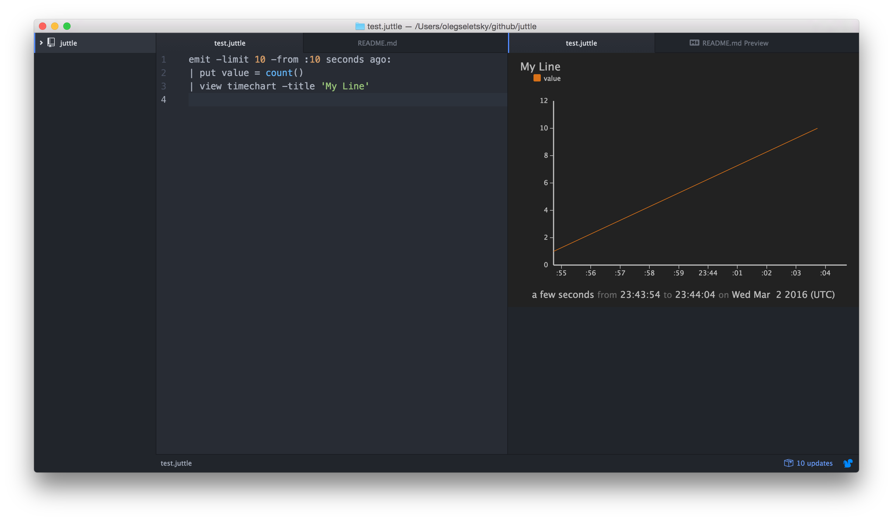

# Atom Juttle Viewer

Run [juttle](https://github.com/juttle/juttle) from atom and see the output.

When a `.juttle` file is open, `ctrl+enter` will run the juttle against a [juttle-service](https://github.com/juttle/juttle-service) instance and render the result in the right-hand pane.

### Configuring

In **package settings**, configure the location of your juttle-service (defaults to `localhost:2000`).
